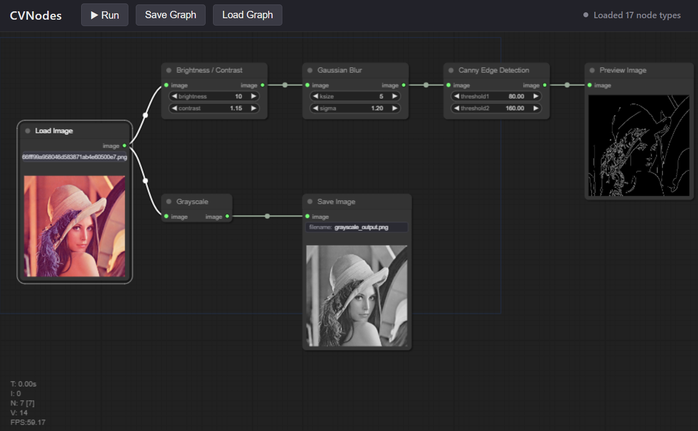

# CVNodes

A ComfyUI-style node-based editor for image processing, built on LiteGraph.js
(frontend) and Python + OpenCV (backend).

<!-- Add a screenshot of the node editor here, e.g. docs/screenshot.png -->


## Features

- 🎨 **Visual Node Editor** - Build OpenCV workflows visually with drag and drop nodes.
- 🧩 **Dynamic Nodes** - Node definitions load from the backend with no frontend changes.
- 🖼️ **Inline Previews** - View image results directly inside nodes.
- 🔌 **Custom Nodes** - Add Python nodes with automatic dependency installation.
- 📂 **Node Categories** - Automatically organize nodes into nested categories.
- 🛡️ **Resilient Startup** - Broken or missing dependency nodes are skipped safely.
- 💾 **Save & Load** - Export and restore workflows as JSON.
- ⏱️ **Execution Timing** - Track execution time for every node.


## Running it

```bash
cd backend
python -m venv .venv
.venv/Scripts/activate   # or: source .venv/bin/activate on macOS/Linux
pip install -r requirements.txt
uvicorn server:app --reload
```

That's it - just the core install. Custom nodes that live in their own
subfolder with a `requirements.txt` (like `custom_nodes/removebg/`) get
their dependencies installed **automatically on server startup**, before
that node is imported - no separate `pip install` step. The first startup
after adding such a node takes longer (it's really running `pip install`
for you); after that it's cached and skipped on every subsequent restart
unless that node's `requirements.txt` changes. If it fails (no internet,
etc.), that one node is skipped with a warning - everything else still
works (see [How it's extensible](#how-its-extensible) below for why one
missing dependency can't take down the rest of the app).

Open http://127.0.0.1:8000

## Try the sample workflows

Both use the bundled `backend/uploads/sample.jpg`. Click **Load Graph** in
the toolbar, pick one of these, then click **Run**.

- `examples/basic_pipeline.json` - `Load Image` branches into two chains:
  `Brightness/Contrast → Gaussian Blur → Canny Edge → Preview Image`, and
  `Grayscale → Save Image`.
- `examples/remove_background.json` - `Load Image → Remove Background →`
  (`Preview Image` + `Save Image`). Uses the `cv/RemoveBackground` custom
  node (see below) - the first run downloads/loads the segmentation model
  and can take ~30s; after that it's fast.

## Using it

1. Double-click the canvas (or right-click → Add Node) to add nodes, e.g.
   `IO > Load Image`, a few `OpenCV/*` filters, and `IO > Preview Image`.
2. Click the image-upload widget on the Load Image node to pick a file - a
   thumbnail appears on the node right away, no need to run anything.
3. Wire nodes together by dragging from output to input dots.
4. Click **Run** in the top toolbar. Every `Preview Image` / `Save Image`
   node shows its result as a thumbnail directly on the node (ComfyUI-style).
5. **Save Graph** / **Load Graph** exports/imports the workflow as JSON.

## Use cases

- **Product photo prep** - `Load Image → Remove Background → Resize → Save Image`, reusable across a whole catalog.
- **OCR preprocessing** - `Grayscale → Threshold`, tuned visually before the output ever hits Tesseract.
- **CV pipeline prototyping** - wire up a filter chain, watch each stage's output live, then port the parameters into a script once they're right.
- **Augmentation preview** - see exactly what `Rotate` / `Flip` / `Brightness-Contrast` do to a sample before running them over a training set.
- **Cutline/QC generation** - `Remove Background → Canny Edge` for print cutlines; `Grayscale → Blur → Threshold` as the first stage of most inspection pipelines.

## How it's extensible

The frontend has **no hardcoded knowledge of any node**. On page load it
calls `GET /api/nodes`, which returns every node currently registered on the
backend (name, category, inputs, outputs, widgets), and builds a LiteGraph
node class for each one on the fly.

**Full guide:** [backend/custom_nodes/README.md](backend/custom_nodes/README.md)
covers the complete node contract (class attributes, all widget types,
image data format, output nodes, error handling, categories/menu grouping,
testing a node without the UI) - the summary below is just the quick
version.

To add a new OpenCV operation:

1. If it needs no extra dependencies, drop a `.py` file straight into
   `backend/custom_nodes/`:

   ```python
   from engine.registry import register_node

   @register_node("cv/MyNode")
   class MyNode:
       NAME = "My Node"
       CATEGORY = "OpenCV/Filters"
       INPUTS = [{"name": "image", "type": "IMAGE"}]
       OUTPUTS = [{"name": "image", "type": "IMAGE"}]
       WIDGETS = [{"name": "amount", "type": "FLOAT", "default": 1.0, "min": 0, "max": 10, "step": 0.1}]

       def run(self, image, amount=1.0):
           ...
           return {"image": result}
   ```

   If it needs a package that isn't already installed, give it its own
   subfolder instead, with the node code as `__init__.py` plus a
   `requirements.txt` next to it - e.g. `backend/custom_nodes/removebg/`
   (the actual `RemoveBackground` node). That subfolder's dependencies get
   installed automatically the next time the server starts, before that
   node is imported.

2. Restart the server. That's it — no frontend changes needed, and no
   manual `pip install` for a dependency-having node either. The module is
   auto-discovered by `backend/custom_nodes/__init__.py`.

`backend/nodes/` holds the built-in nodes this project ships with (IO,
basic OpenCV filters); `backend/custom_nodes/` is where your own additions
go. Both folders work identically - it's purely a convention to keep "what
this project ships with" separate from "what you added" - and a node
module that fails to import (bad code, a dependency install that failed)
is skipped with a warning instead of crashing the server.

Supported `WIDGETS` types: `INT`, `FLOAT`, `BOOL`, `STRING`, `COMBO`
(needs an `"options": [...]` list), and `IMAGE_UPLOAD` (renders a
file-picker button, used by `LoadImage`).
## Project layout

```
backend/
  server.py            FastAPI app: serves the frontend + /api/nodes, /api/upload, /api/execute
  config.py            upload/output directory paths
  requirements.txt     core app + built-in node dependencies (always installed)
  engine/
    registry.py         @register_node decorator + node registry
    graph.py             topological sort + graph execution
    image_io.py           numpy <-> base64 PNG conversions
    discovery.py           shared auto-import + per-node auto-install used by nodes/ and custom_nodes/
  nodes/                built-in nodes (ships with the project)
    __init__.py           auto-imports every module in this package
    io_nodes.py            LoadImage, PreviewImage, SaveImage
    basic_nodes.py         Grayscale, Blur, Canny, Threshold, Resize, etc.
  custom_nodes/         your extensions go here (see custom_nodes/README.md)
    __init__.py           auto-imports every module/subfolder in this package
    removebg/             example node with its own dependency:
      __init__.py           the RemoveBackground node
      requirements.txt       installed automatically on server startup
frontend/
  index.html
  js/app.js             fetches /api/nodes, builds LiteGraph node classes dynamically
  css/style.css
```

## Notes / current limitations (kept simple on purpose)

- No caching between runs — every Run re-executes the whole graph.
- Single-user, no auth — meant for local use.
